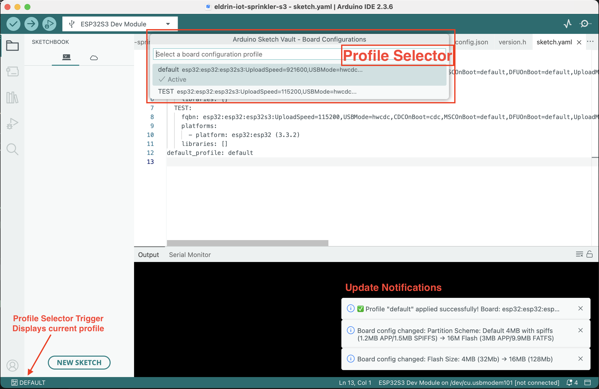

# Arduino Sketch Vault


[](https://codecov.io/gh/devista-consulting/arduino-sketch-vault)


A powerful VS Code extension for Arduino IDE that provides **automated configuration logging** and **profile-based board configuration management** to streamline your Arduino development workflow.

> ⚠️ **Early Development Notice**
>
> This extension is currently in early development stage. While it has been tested and includes comprehensive unit tests, you may encounter bugs or unexpected behavior. Please:
> - **Use with caution** in production environments
> - **Back up your sketch.yaml** files before using auto-update features
> - **Report any issues** you encounter on [GitHub Issues](https://github.com/devista-consulting/arduino-sketch-vault/issues)
> - **Consider testing** in a non-critical project first
>
> Your feedback and bug reports are invaluable in helping us improve the extension!

## Preview



*Profile selector showing saved board configurations with instant switching capability. The status bar trigger displays the currently active profile.*

## Why Arduino Sketch Vault?

- **Never lose track of board settings** - Automatically logs every configuration change
- **Switch between board configurations instantly** - Save and apply complete board profiles with one click
- **Perfect for multi-board projects** - Manage different configurations for development, testing, and production
- **Team collaboration made easy** - Share board configurations via `sketch.yaml` in version control
- **Cross-machine consistency** - Apply the same board configuration on any computer

## Requirements

- **Arduino IDE 2.0 or later**
- This extension works exclusively in Arduino IDE (which is built on VS Code/Eclipse Theia)
- Does NOT work in standard VS Code

> ⓘ **Note**: The extension requires the Arduino IDE environment to access board configuration APIs. Standard VS Code installations are not supported.

## Installation

### Method 1: Install from VSIX (Recommended)

1. Download the latest `.vsix` file from [GitHub Releases](https://github.com/devista-consulting/arduino-sketch-vault/releases)
2. **Close Arduino IDE completely** (important!)
3. Copy the `.vsix` file to Arduino IDE's plugins directory:

   **macOS:**
   ```bash
   cp vscode-arduino-sketch-vault-*.vsix ~/Library/Application\ Support/arduino-ide/plugins/
   ```

   **Linux:**
   ```bash
   cp vscode-arduino-sketch-vault-*.vsix ~/.config/arduino-ide/plugins/
   ```

   **Windows (PowerShell):**
   ```powershell
   Copy-Item vscode-arduino-sketch-vault-*.vsix "$env:LOCALAPPDATA\Arduino IDE\plugins\"
   ```

4. Start Arduino IDE
5. The extension should activate automatically

> ⓘ **Tip**: If the plugins directory doesn't exist, create it first:
> - macOS: `mkdir -p ~/Library/Application\ Support/arduino-ide/plugins/`
> - Linux: `mkdir -p ~/.config/arduino-ide/plugins/`
> - Windows: `mkdir "$env:LOCALAPPDATA\Arduino IDE\plugins\"`

### ~~Method 2: Install via Command Palette~~

1. ~~Download the latest `.vsix` file~~
2. ~~Open Arduino IDE~~
3. ~~Open Command Palette:~~
   - ~~macOS: `Cmd+Shift+P`~~
   - ~~Windows/Linux: `Ctrl+Shift+P`~~
4. ~~Type: `Extensions: Install from VSIX...`~~
5. ~~Select the downloaded `.vsix` file~~
6. ~~Restart Arduino IDE~~

### Verify Installation

After installation, you should see:
- `$(circuit-board) VAULT` in the status bar (bottom left)
- "Arduino Sketch Vault" commands in the Command Palette
- "Arduino Sketch Vault" in the Output panel dropdown

## Features

### 🔄 Profile Management System

Manage multiple board configurations as profiles with instant switching via the status bar.

- **Quick Profile Switching**: Click the status bar to instantly switch between saved configurations
- **Complete Configuration Capture**: Saves FQBN with all options (Upload Speed, CPU Frequency, Flash Size, etc.)
- **sketch.yaml Integration**: Profiles are stored in standard `sketch.yaml` format
- **Visual Status Bar**: Shows current active profile with circuit board icon
- **Auto-Apply on Startup**: Prompts to apply default profile when opening a sketch

**Status Bar Interface:**
```
Click: $(circuit-board) PRODUCTION → Opens profile picker
```

**Example Workflow:**
1. Configure board for development: ESP32-S3 @ 921600 baud, 240MHz CPU
2. Save as "development" profile
3. Configure board for production: ESP32-S3 @ 115200 baud, 160MHz CPU
4. Save as "production" profile
5. Switch between profiles with one click!

### 📋 Automatic Configuration Logging

Track every board configuration change with detailed logging to multiple outputs.

- **Comprehensive Change Tracking**:
  - Full FQBN (Fully Qualified Board Name) with all configuration options
  - Upload Speed, CPU Frequency, Flash Size, and all board-specific options
  - Port selection changes
  - Before/after values for every change

- **Multiple Output Channels**:
  - **JSON Log File**: Machine-readable `.arduino-sketch-vault.json` in your workspace
  - **Output Panel**: Real-time viewing in "Arduino Sketch Vault" output channel
  - **Toast Notifications**: Visual feedback for configuration changes

- **Rich Context**: Each log entry includes:
  - ISO 8601 timestamp
  - Sketch path
  - Complete board configuration
  - Individual changes with before/after values
  - Change type classification (initial, fqbn, board, port)

### 🔗 Bidirectional sketch.yaml Sync

Keep your sketch.yaml and Arduino IDE perfectly synchronized.

- **IDE → sketch.yaml (Auto-Update)**: Automatically updates sketch.yaml when you change board settings
- **sketch.yaml → IDE (Manual Apply)**: Apply saved configurations to Arduino IDE with one command
- **Profile-Aware Updates**: Updates the correct profile based on `default_profile` field
- **Library Preservation**: Keeps your libraries section intact during FQBN updates
- **Configurable**: Can be disabled via settings if managing sketch.yaml manually

## Usage

### Profile Management

#### Creating Your First Profile

1. **Configure your board** in Arduino IDE (Tools menu):
   - Select board (e.g., ESP32-S3)
   - Set Upload Speed (e.g., 921600)
   - Set CPU Frequency (e.g., 240MHz)
   - Configure other options as needed

2. **Save as profile**:
   - Open Command Palette (`Cmd/Ctrl+Shift+P`)
   - Run: **"Arduino Sketch Vault: Create Board Configuration"**
   - Enter profile name (e.g., "development")
   - Choose whether to switch to this profile now

3. **Verify**:
   - Status bar shows: `$(circuit-board) DEVELOPMENT`
   - `sketch.yaml` is created/updated in your sketch folder

#### Switching Between Profiles

**Via Status Bar (Quick):**
1. Click `$(circuit-board) PROFILE_NAME` in status bar
2. Select profile from picker
3. Arduino IDE automatically applies the configuration

**Via Command Palette:**
1. Open Command Palette (`Cmd/Ctrl+Shift+P`)
2. Run: **"Arduino Sketch Vault: Switch Board Configuration"**
3. Select profile
4. Configuration applied automatically

#### Auto-Apply on Startup

When you open a sketch with an existing `sketch.yaml`:

1. Extension prompts: "Apply 'PROFILE_NAME' configuration?"
2. Shows board details (e.g., "ESP32-S3 @ 921600 baud")
3. Click "Yes" to apply, "No" to skip
4. Board configuration syncs with your saved profile

> ⓘ **Tip**: This ensures your Arduino IDE always starts with the correct configuration for each project.

### Configuration Logging

The extension automatically logs all board configuration changes:

#### Viewing Logs

**Real-time Output Panel:**
- View → Output → Select "Arduino Sketch Vault" from dropdown
- Or run command: **"Arduino Sketch Vault: Show Logs"**

**JSON Log File:**
- Located at: `<sketch-folder>/.arduino-sketch-vault.json`
- Machine-readable for automation and analysis
- Append-only (preserves full history)

**Toast Notifications:**
- Automatically appear when configuration changes
- Shows summary (e.g., "Upload Speed changed: 921600 → 115200")
- Not shown for initial state logging

#### Example Log Entry

```json
{
  "timestamp": "2025-10-20T14:32:15.123Z",
  "sketchPath": "/Users/yourname/Arduino/MyProject",
  "fqbn": "esp32:esp32:esp32s3:UploadSpeed=921600,CPUFreq=240,FlashSize=16M",
  "board": {
    "name": "ESP32-S3",
    "fqbn": "esp32:esp32:esp32s3:UploadSpeed=921600,CPUFreq=240,FlashSize=16M"
  },
  "port": {
    "address": "/dev/cu.usbserial-14230",
    "protocol": "serial"
  },
  "changes": [
    {
      "option": "UploadSpeed",
      "label": "Upload Speed",
      "previousValue": "115200",
      "newValue": "921600",
      "previousLabel": "115200",
      "newLabel": "921600"
    }
  ],
  "changeType": "board"
}
```

#### Clearing Logs

To clear all logs and reset state:
- Run command: **"Arduino Sketch Vault: Clear Logs"**
- Deletes `.arduino-sketch-vault.json` file
- Clears in-memory state

### sketch.yaml Management

#### Understanding sketch.yaml Structure

```yaml
profiles:
  default:
    fqbn: esp32:esp32:esp32s3:UploadSpeed=921600,CPUFreq=240
    platforms:
      - platform: esp32:esp32 (3.0.7)
    libraries: []

  production:
    fqbn: esp32:esp32:esp32s3:UploadSpeed=115200,CPUFreq=160
    platforms:
      - platform: esp32:esp32 (3.0.7)
    libraries: []

default_profile: default
```

- **profiles**: Dictionary of named configurations
- **default_profile**: Currently active profile (auto-updated by extension)
- **fqbn**: Complete board configuration with all options
- **platforms**: Board package with version
- **libraries**: Project dependencies (preserved by extension)

#### Creating sketch.yaml

**From Current Configuration:**
1. Configure board in Arduino IDE
2. Run: **"Arduino Sketch Vault: Create sketch.yaml"**
3. File created with "default" profile
4. Opens automatically for review

**Manual Creation:**
1. Create `sketch.yaml` in sketch folder
2. Add profiles and default_profile field
3. Use extension to apply configuration

#### Applying Configuration

To apply a profile from sketch.yaml to Arduino IDE:

1. Ensure `sketch.yaml` exists in sketch folder
2. Set `default_profile` to desired profile name
3. Run: **"Arduino Sketch Vault: Apply sketch.yaml Configuration"**
4. Extension will:
   - Select base board
   - Apply all configuration options
   - Show progress notification
   - Update status bar

#### Auto-Update Behavior

When **enabled** (default):
- Any board configuration change in Arduino IDE updates sketch.yaml
- Updates the profile specified by `default_profile`
- Preserves libraries and other profile settings
- Shows notification on update

When **disabled**:
- sketch.yaml only updates via manual commands
- Useful if managing sketch.yaml manually or via other tools
- Still logs all changes to vault

## Commands

Access all commands via Command Palette (`Cmd/Ctrl+Shift+P`):

| Command | Description |
|---------|-------------|
| **Arduino Sketch Vault: Switch Board Configuration** | Opens profile picker to switch between saved configurations |
| **Arduino Sketch Vault: Create Board Configuration** | Saves current board configuration as a new profile |
| **Arduino Sketch Vault: Apply sketch.yaml Configuration** | Applies default profile configuration to Arduino IDE |
| **Arduino Sketch Vault: Create sketch.yaml** | Creates sketch.yaml from current board configuration |
| **Arduino Sketch Vault: Show Logs** | Opens the log output channel |
| **Arduino Sketch Vault: Clear Logs** | Clears all logs and resets state |

## Configuration

Settings are available in Arduino IDE Preferences:

| Setting | Type | Default | Description |
|---------|------|---------|-------------|
| `arduino-sketch-vault.autoUpdateSketchYaml` | boolean | `true` | Automatically update sketch.yaml when board configuration changes in Arduino IDE |

**To modify settings:**
1. File → Preferences → Settings
2. Search for "Arduino Sketch Vault"
3. Toggle auto-update as needed

## Use Cases

### Multi-Environment Development

**Scenario**: Different configurations for development vs. production

```yaml
profiles:
  development:
    fqbn: esp32:esp32:esp32s3:UploadSpeed=921600,CPUFreq=240,DebugLevel=verbose
  production:
    fqbn: esp32:esp32:esp32s3:UploadSpeed=115200,CPUFreq=160,DebugLevel=none
default_profile: development
```

Switch instantly between environments via status bar.

### Team Collaboration

**Scenario**: Multiple developers working on same project

1. Developer A configures board perfectly for the project
2. Creates profile and commits `sketch.yaml` to git
3. Developer B clones repository
4. Extension prompts to apply profile on startup
5. Both developers have identical board configuration

### Multi-Board Projects

**Scenario**: Project supports multiple Arduino boards

```yaml
profiles:
  esp32-dev:
    fqbn: esp32:esp32:esp32s3:UploadSpeed=921600
  arduino-uno:
    fqbn: arduino:avr:uno
  nano-33-iot:
    fqbn: arduino:samd:nano_33_iot
default_profile: esp32-dev
```

Switch between boards instantly without reconfiguring.

### Configuration Debugging

**Scenario**: Tracking down when a setting changed

1. Review `.arduino-sketch-vault.json` log file
2. Search for configuration option (e.g., "CPUFreq")
3. See complete timeline of changes with timestamps
4. Identify when issue was introduced

### Cross-Machine Consistency

**Scenario**: Working on desktop and laptop

1. Configure board on desktop
2. Commit `sketch.yaml` to version control
3. Pull on laptop
4. Apply configuration via command
5. Identical setup on both machines

## Troubleshooting

### Extension Not Activating

**Symptoms**: No status bar item, no commands available

**Solutions**:
1. Verify you're using **Arduino IDE 2.0+** (not standard VS Code)
2. Check Developer Tools (Help → Toggle Developer Tools) for errors
3. Ensure `.vsix` file is in correct plugins directory
4. Try reinstalling via Command Palette method
5. Restart Arduino IDE completely

### Profile Not Applying

**Symptoms**: Configuration doesn't change when switching profiles

**Solutions**:
1. Check Output panel (View → Output → "Arduino Sketch Vault") for errors
2. Verify board package is installed (Tools → Board → Boards Manager)
3. Check FQBN syntax in `sketch.yaml` is correct
4. Try manually selecting board first, then switch profile
5. Wait 10 seconds for commands to register (boards loading)

### Auto-Update Not Working

**Symptoms**: sketch.yaml doesn't update when changing board settings

**Solutions**:
1. Check setting: `arduino-sketch-vault.autoUpdateSketchYaml` is `true`
2. Verify `sketch.yaml` exists in sketch folder
3. Check `default_profile` field exists and is valid
4. Review Output panel for error messages
5. Try manually creating sketch.yaml first

### Status Bar Shows "VAULT" Instead of Profile Name

**Causes**:
- No `sketch.yaml` in current sketch folder (expected)
- No `default_profile` field in sketch.yaml
- `default_profile` references non-existent profile

**Solutions**:
1. Create a profile: **"Create Board Configuration"**
2. Or create sketch.yaml: **"Create sketch.yaml"**
3. Verify `default_profile` matches profile name exactly

### Invalid FQBN Errors

**Symptoms**: Error when applying profile: "Board not found"

**Solutions**:
1. Install required board package (Tools → Board → Boards Manager)
2. Verify FQBN format: `vendor:arch:board:option1=value1,option2=value2`
3. Check for typos in profile FQBN
4. Ensure board package version matches (check platforms section)

### Logs File Missing

**Symptoms**: `.arduino-sketch-vault.json` not created

**Solutions**:
1. Verify workspace/sketch folder is open
2. Check file permissions in sketch directory
3. Make a board configuration change to trigger logging
4. Check Output panel for write errors

## Development

### Building from Source

```bash
# Install dependencies
npm install

# Compile TypeScript
npm run compile

# Watch mode for development
npm run watch
```

### Testing

Comprehensive test suite with >70% code coverage:

```bash
# Run all tests
npm test

# Run tests in watch mode
npm run test:watch

# Generate coverage report
npm run test:coverage

# Run only unit tests
npm run test:unit
```

See [TESTING.md](./TESTING.md) for detailed testing information.

### Packaging Extension

```bash
# Create .vsix file
npm run package

# If Node version issues:
bash -c "source ~/.nvm/nvm.sh && nvm use 20 && npx vsce package"
```

Output: `vscode-arduino-sketch-vault-{version}.vsix`

### Project Structure

```
arduino-sketch-vault/
├── src/
│   ├── extension.ts              # Main entry point and orchestration
│   ├── profile-service.ts        # Profile management and switching
│   ├── board-sync-service.ts     # Bidirectional IDE sync via commands
│   ├── sketch-yaml-service.ts    # sketch.yaml CRUD operations
│   ├── log-service.ts            # Multi-output logging system
│   ├── config-state-tracker.ts   # State tracking and change detection
│   └── types.ts                  # Type definitions
├── out/                          # Compiled JavaScript (gitignored)
├── test/                         # Unit and integration tests
├── package.json                  # Extension manifest
├── tsconfig.json                 # TypeScript configuration
└── README.md                     # This file
```

See [CLAUDE.md](./CLAUDE.md) for detailed architecture documentation.

## Contributing

Contributions are welcome! Please:

1. Fork the repository
2. Create a feature branch (`git checkout -b feature/amazing-feature`)
3. Make your changes
4. Add/update tests as needed
5. Ensure tests pass (`npm test`)
6. Commit your changes (`git commit -m 'Add amazing feature'`)
7. Push to the branch (`git push origin feature/amazing-feature`)
8. Open a Pull Request

## License

MIT License - see [LICENSE](LICENSE) file for details.

## Support

- **Bug Reports**: [GitHub Issues](https://github.com/devista-consulting/arduino-sketch-vault/issues)
- **Feature Requests**: [GitHub Issues](https://github.com/devista-consulting/arduino-sketch-vault/issues)
- **Discussions**: [GitHub Discussions](https://github.com/devista-consulting/arduino-sketch-vault/discussions)

## Acknowledgments

- Built for [Arduino IDE](https://github.com/arduino/arduino-ide)
- Uses [vscode-arduino-api](https://github.com/dankeboy36/vscode-arduino-api) by dankeboy36
- Inspired by the Arduino community's need for better configuration management

---

**Development supported by [Devista](https://devista.io)**
